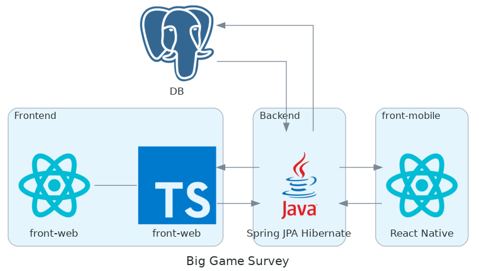
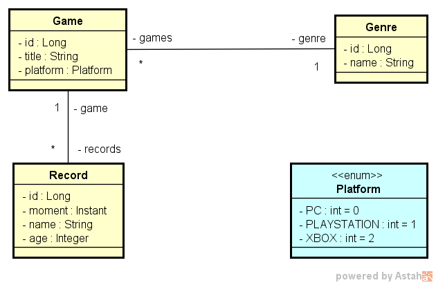
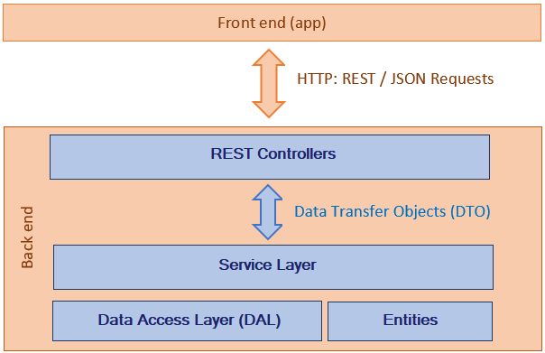

# Big Game Survey

[](https://github.com/opapito/dspesquisa/blob/master/LICENSE)

## About the project

The [Game Survey project](https://sds1-opapito.netlify.app/ "Game Survey") is a  survey app composed of a front-end web application written in React/TypeScript, a front-mobile, written in react native, and a Spring Data Java Persistence API (JPA) with Hibernate Object-Relational Mapping (ORM) working as back-end serving data through a PostgreSQL database hosted on Heroku. The front-web app is hosted on Netlify. The survey data collected in the front-mobile is stored in the back-end and can be accessed through the front-web app. The app core was developed during the second edition of dev superior week, but it was refactored after with the adding of several features enhancing its functionality, UI and reliability, notably in the front-mobile version.

## Mobile layout


## Web layout


## Project Design



## Concept model



## Data access layer



## Technologies

### Backend

- Java
- Spring Boot
- JPA / Hibernate
- Maven

### Frontend web

- HTML / CSS / JS / TypeScript
- ReactJS/React Hooks
- Apex Charts

### Frontend mobile

- HTML / CSS / JS / TypeScript
- React Native
- Expo framework
- Victory Charts


### Deployment in production

- Back end: Heroku
- Front end web: Netlify
- Database: Postgresql

## Installing

### Backend

Prerequisites: Java 11

```bash
# The first step is to clone the project
git clone https://github.com/opapito/dsdeliver-sds2

# Enter the project directory
cd backend

# Run
./mvnw spring-boot:run
```

### Frontend web

Prerequisites: npm / yarn

```bash
# The first step is to clone the project
git clone https://github.com/devsuperior/sds1-wmazoni

# Enter the project directory
cd front-web

# Install dependencies
yarn install

# Run
yarn start
```
